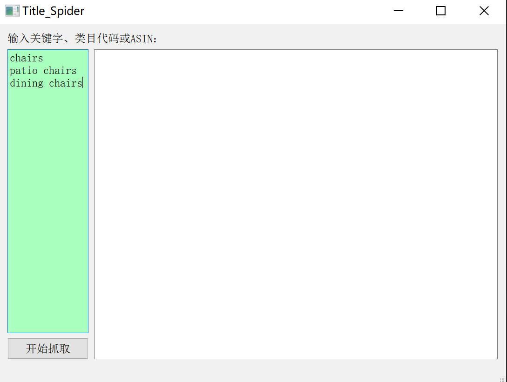
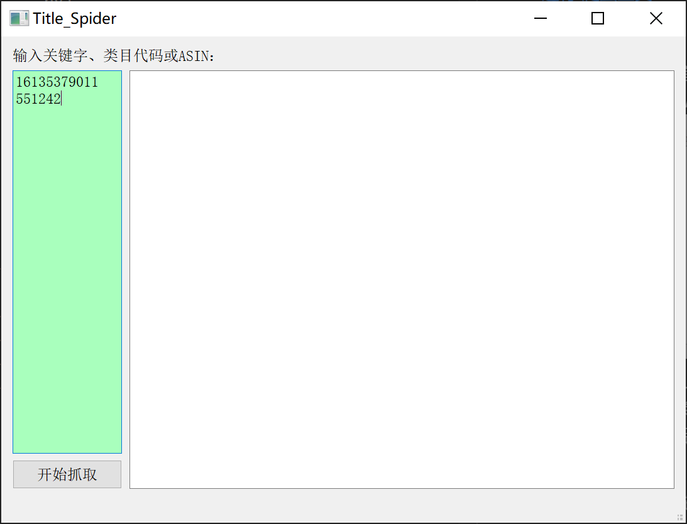
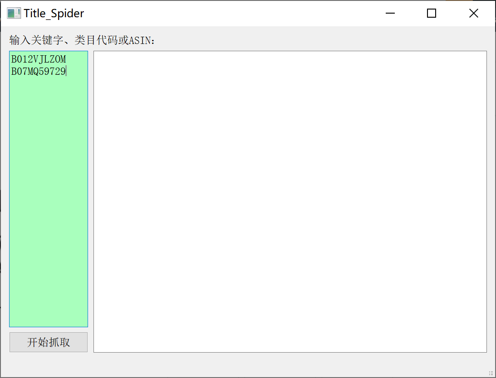
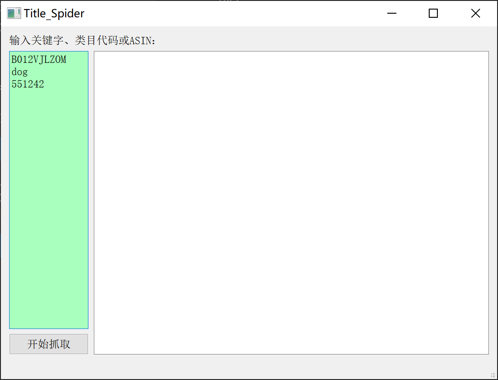
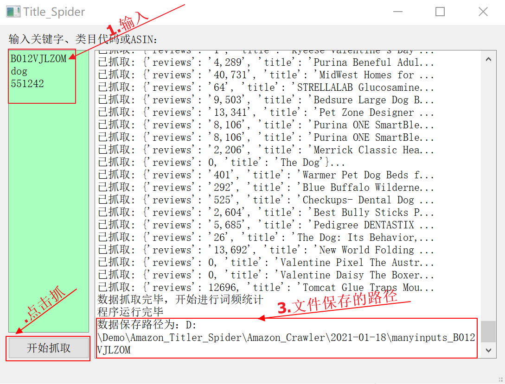

## 关键字抓取
[运行 爬虫工具](Amazon_Crawler/main.py)

功能：
1. 抓取亚马逊首页搜索**关键字**后，前三页的title和reviews,输入关键字即可

2. 抓取亚马逊小类目前top100商品的title和reviews，输入bestseller类目编号即可
   

3. 抓取相关产品ASIN的title和reviews，输入产品ASIN即可

4. 也可以选择三种模式混合输入

执行步骤：

1. 输入关键字，如果输入多个需要记得换行
2. 点击**开始抓取**按钮
3. 程序运行结束后会打印出文件保存的路径，复制文件路径至文件夹打开即可
   

