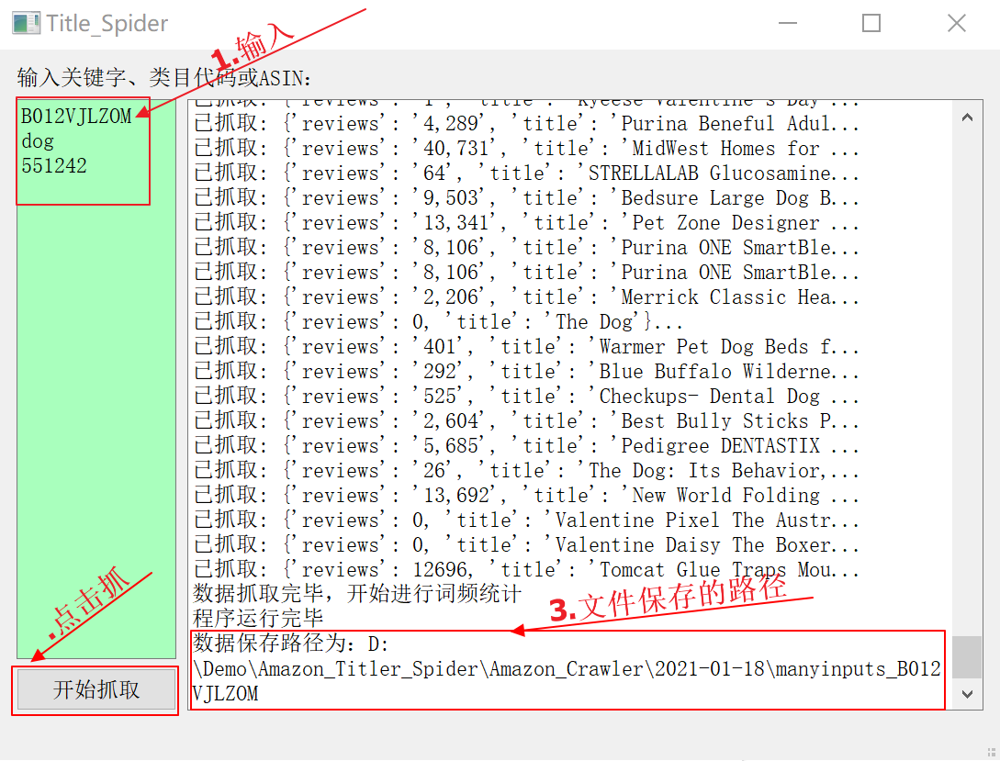

# GodsEye

数据分析客户端主要用于Cocam数据分析工具的发布与维护

- 目录
  - [Amazon关键词获取](##1、关键字抓取)

## 1、关键字抓取

  **切记运行此工具前要打开VPN**

[运行 爬虫工具](Amazon_Title_Spider/Amazon_Crawler/main.py)

使用方法：

1. 输入关键字，如果输入多个需要记得换行
2. 点击**开始抓取**按钮，选择文件保存路径
3. 程序运行结束后会打印出文件保存的路径，复制文件路径至文件夹打开即可
   

